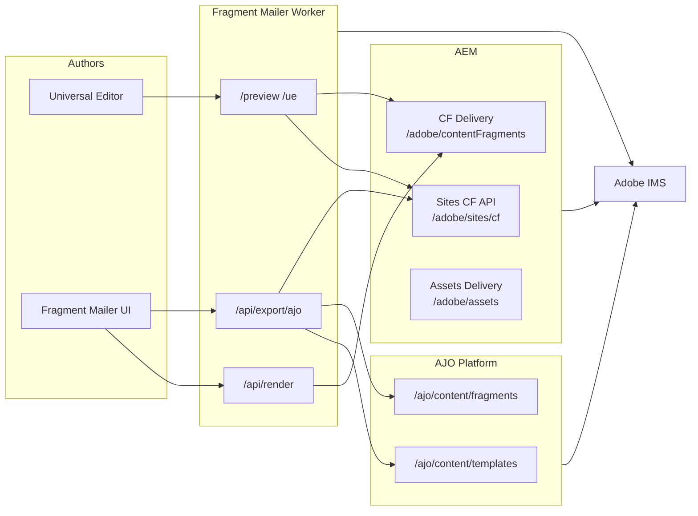
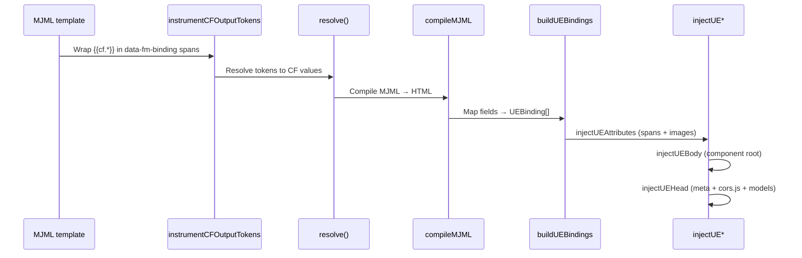

# Fragment Mailer — Technical Overview

Fragment Mailer is a SvelteKit app deployed on Cloudflare Workers. It sits between **AEM** (content source) and **AJO** (sending platform): it fetches Content Fragments, renders MJML templates, serves UE-instrumented preview HTML, validates content, and exports AJO-ready HTML.

This document covers external APIs (by Adobe product), Universal Editor instrumentation, and known gotchas.

---

## Architecture (high level)



**Two AEM access patterns:**

| Mode | When | Auth | API base |
|------|------|------|----------|
| **Publish tier** | Campaign list/preview without UE session | Optional CDN Edge Key (`X-Api-Key`) | `AEM_BASE_URL` (publish host) |
| **Author tier** | `AEM_TIER=author`, or UE session cookies | OAuth S2S *or* UE-forwarded user token | Author host |

---

## External APIs by product

### Adobe IMS (Identity Management Service)

Used for server-to-server tokens. All calls use HTTPS.

| Endpoint | Method | Purpose |
|----------|--------|---------|
| `https://{IMS_HOST}/ims/token/v3` | POST | Client-credentials token (`grant_type=client_credentials`) |

**Two credential contexts:**

| Consumer | Env vars | Default scopes |
|----------|----------|----------------|
| AEM Author (campaign fetch, CF models) | `IMS_CLIENT_ID`, `IMS_CLIENT_SECRET`, `IMS_ORG_ID`, `IMS_SCOPES` | `openid`, `AdobeID`, `aem.folders`, `aem.assets.author`, `aem.fragments.management` |
| AJO Platform API | `AJO_IMS_CLIENT_ID` / `AJO_IMS_CLIENT_SECRET` (falls back to `IMS_*`) | Includes `additional_info.projectedProductContext` for correct `platform.adobe.io` region |

Implementation: `src/lib/auth/ims.ts`, `src/lib/auth/token-provider.ts`, `src/lib/auth/ajo-token-provider.ts`.

Tokens are cached in memory with a 30s expiry buffer. AJO client retries once on 401 after cache reset.

---

### AEM as a Cloud Service

#### 1. Content Fragment Delivery OpenAPI (Publish)

Primary read path when `AEM_TIER=publish` and `AEM_FETCH_MODE=openapi` (default).

| Endpoint | Method | Purpose |
|----------|--------|---------|
| `{publish}/adobe/contentFragments?path={folder}` | GET | List CFs in a DAM folder |
| `{publish}/adobe/contentFragments?path={cfPath}&references=all-hydrated` | GET | Fetch CF by DAM path with hydrated refs |
| `{publish}/adobe/contentFragments/{uuid}?references=all-hydrated` | GET | Fetch CF by UUID |

Headers: `Accept: application/json`, optional `X-Api-Key` (CDN Edge Key), optional `Authorization: Bearer` (service token).

Implementation: `src/lib/aem/client.ts`.

**Do not call `/adobe/contentFragments` on Author** — use Sites CF Management API instead.

#### 2. GraphQL persisted queries (Publish fallback)

Used when `AEM_FETCH_MODE=graphql` (e.g. Delivery OpenAPI not enabled on Publish).

| Endpoint | Method | Purpose |
|----------|--------|---------|
| `{publish}/graphql/execute.json/{endpoint}/{listQuery}` | GET | List campaigns |
| `{publish}/graphql/execute.json/{endpoint}/{byPathQuery};{param}={path}` | GET | Single campaign by path |

Configurable via `AEM_GRAPHQL_ENDPOINT`, `AEM_GRAPHQL_LIST_QUERY`, `AEM_GRAPHQL_BY_PATH_QUERY`, `AEM_GRAPHQL_BY_PATH_PARAM`.

Implementation: `src/lib/aem/graphql.ts`.

**Limitation:** Only fields defined in the persisted query in AEM are returned — not the full CF model.

#### 3. Sites Content Fragment Management API (Author)

Used for Author-tier campaign loading, UE live editing, and AJO export UUID resolution.

| Endpoint | Method | Purpose |
|----------|--------|---------|
| `{author}/adobe/sites/cf/fragments?path={folder}` | GET | List fragments |
| `{author}/adobe/sites/cf/fragments/{id}?references=...&depth={n}` | GET | Fetch fragment (+ nested refs) |
| `{author}/adobe/sites/cf/models/{id}` | GET | CF model schema (UE properties panel) |

**Auth:**

- **S2S:** OAuth bearer from `getAemAccessToken()` when `AEM_TIER=author`.
- **UE session:** User IMS token from httpOnly `aem_token` cookie via `createCfClient()` — token is **never refreshed** server-side; expired tokens return 401.

Implementation: `src/lib/aem/author.ts`, `src/lib/server/aem/cfClient.ts`.

Nested reference depth defaults to 3 (`AEM_CF_REFERENCE_DEPTH`) for email → offer → asset chains.

#### 4. AEM Assets Delivery / Dynamic Media (Publish CDN)

When `USE_DYNAMIC_MEDIA=true`, image reference fields resolve to SEO-format delivery URLs instead of raw DAM paths.

| Pattern | Example |
|---------|---------|
| Asset SEO URL | `https://{delivery-host}/adobe/assets/{assetId}/as/{seoName}.{format}` |

`delivery-*` host is derived from `publish-*` (`author-*` → `publish-*` → `delivery-*`) unless `AEM_DELIVERY_HOST` is set.

Implementation: `src/lib/aem/dynamic-media.ts`.

**Gotcha:** Only **approved/published** assets are served from delivery CDN; `DRAFT` assets 404.

---

### Adobe Journey Optimizer (AJO)

Base URL: `https://platform.adobe.io`

All requests require:

```
Authorization: Bearer {token}
x-api-key: {clientId}
x-gw-ims-org-id: {IMS_ORG_ID}
x-sandbox-name: {AJO_SANDBOX}
```

#### Content Templates API

| Endpoint | Method | Content-Type | Purpose |
|----------|--------|--------------|---------|
| `/ajo/content/templates` | GET | `application/vnd.adobe.ajo.template-list.v1+json` | List email templates |
| `/ajo/content/templates` | POST | `application/vnd.adobe.ajo.template.v1+json` | Create template |
| `/ajo/content/templates/{id}` | GET | `application/vnd.adobe.ajo.template.v1+json` | Get template (+ `etag`) |
| `/ajo/content/templates/{id}` | PUT | `application/vnd.adobe.ajo.template.v1+json` | Update (`If-Match: etag`) |

Implementation: `src/lib/ajo/client.ts`, `src/lib/ajo/types.ts`.

PUT prefetches etag; 409 version conflicts (`JOMAL-1101`) trigger one etag refresh and retry.

#### Content Fragments API (expression fragments)

| Endpoint | Method | Content-Type | Purpose |
|----------|--------|--------------|---------|
| `/ajo/content/fragments` | GET | `application/vnd.adobe.ajo.fragment-list.v1.0+json` | List fragments |
| `/ajo/content/fragments` | POST | `application/vnd.adobe.ajo.fragment.v1.0+json` | Create expression fragment |
| `/ajo/content/fragments/{id}` | GET/PUT | `application/vnd.adobe.ajo.fragment.v1.0+json` | Read/update fragment |
| `/ajo/content/fragments/{id}/references` | GET | — | Fragment dependency graph |
| `/ajo/content/fragments/{id}/liveFragment` | GET | — | Published live content |
| `/ajo/content/fragments/publications` | POST | `application/vnd.adobe.ajo.fragment.publication.request.v1.0+json` | Publish fragment |

Implementation: `src/lib/ajo/fragments-client.ts`, `src/lib/ajo/fragment-types.ts`.

AJO reads AEM CFs from **Publish only** — export builds `repoId` from `AEM_PUBLISH_HOST` (required when `AEM_TIER=author`).

**AEM CF reference syntax in AJO HTML:**

```handlebars
{{fragment id="aem:{uuid}?repoId={publish-host}" result="cf"}}
{{cf.fieldName}}
```

---

### Universal Editor Service

| Resource | URL | Purpose |
|----------|-----|---------|
| CORS bridge | `https://universal-editor-service.adobe.io/cors.js` | Lets UE overlay attach to third-party preview origins |
| UE shell | `https://experience.adobe.com/...` | Referer used to detect UE context |

UE writes field edits **directly to AEM** via the AEMaaCS UE service. Fragment Mailer is a rendering proxy — it does not persist CF edits.

Connection meta format:

```html
<meta name="urn:adobe:aue:system:aemconnection" content="aem:https://author-pXXXX-eXXXX.adobeaemcloud.com">
```

UE config must register the same connection name (`aemconnection`).

---

### Cloudflare (runtime)

| Binding | Purpose |
|---------|---------|
| D1 (`DB`) | Template versions, push status, personas, brands (seeded on first access) |
| Worker `ASSETS` | SvelteKit static assets |
| Secrets / vars | Adobe credentials, auth (`APP_AUTH_SECRET`, Cloudflare Access) |

Local dev: use `wrangler dev` / `bun run preview` for D1 bindings. Plain `vite dev` uses in-memory DB fallback.

---

## Fragment Mailer internal APIs

Grouped by concern. All `/api/*` routes may require auth when `APP_AUTH_SECRET` or Cloudflare Access is configured.

### Campaigns & AEM

| Route | Method | Description |
|-------|--------|-------------|
| `/api/campaigns` | GET | List campaigns from AEM |
| `/api/campaigns/{id}` | GET | Campaign + normalized CF data |
| `/api/campaigns/{id}/template-preference` | GET/PUT | Per-campaign template override |
| `/api/campaigns/{id}/ajo-link` | GET | Experience Cloud deep link |
| `/api/aem/cf-models` | GET | List CF models (Author) |
| `/api/aem/cf-models/{id}` | GET | Single CF model |

### Render & validate

| Route | Method | Description |
|-------|--------|-------------|
| `/api/render` | POST | Full pipeline: fetch CF → resolve → MJML → UE inject |
| `/api/compile` | POST | MJML compile only |
| `/api/validate` | POST | CF field + HTML validation rules |
| `/preview/{campaignId}` | GET | UE-ready HTML document (iframe source) |

### Templates & UE assets

| Route | Method | Description |
|-------|--------|-------------|
| `/api/templates` | GET/POST | Managed templates (D1) |
| `/api/templates/{id}` | GET/PUT/DELETE | Template CRUD |
| `/api/templates/{id}/component-definition` | GET | UE insert menu (`application/vnd.adobe.aue.component+json`) |
| `/api/templates/{id}/component-models` | GET | UE properties panel (`application/vnd.adobe.aue.model+json`) |
| `/api/templates/{id}/versions` | GET | Version history |

### AJO export & sync

| Route | Method | Description |
|-------|--------|-------------|
| `/api/export` | GET | HTML + manifest JSON (offline handoff) |
| `/api/export/ajo` | GET/POST | Transform for AJO; POST with `push=true` calls Templates API (**strict auth**) |
| `/api/ajo/templates` | GET | Proxy list from AJO |
| `/api/ajo/fragments` | GET/POST | List/create AJO expression fragments |
| `/api/ajo/fragments/{id}` | GET/PUT | Fragment CRUD |
| `/api/ajo/fragments/{id}/publish` | POST | Trigger publication |
| `/api/ajo/fragments/{id}/references` | GET | Dependency list |

### Session & UE routes

| Route | Method | Description |
|-------|--------|-------------|
| `/api/session` | POST/DELETE | Store/clear UE IMS token cookies (**POST = strict auth**) |
| `/ue/{fragmentId}` | GET | Single-CF UE canvas |
| `/editor/{campaignId}` | GET | Three-panel editor (redirects to `/preview` when opened from UE) |

---

## Universal Editor instrumentation

UE attachment is a **post-MJML-compile** HTML transformation pipeline. Source: `src/lib/render/inject-ue.ts`, `src/lib/render/ue-bindings.ts`.

### Pipeline stages



### 1. Pre-compile token instrumentation (`instrumentCFOutputTokens`)

Before resolution, every `{{cf.fieldName}}` (and `` aliases) is wrapped:

```html
<span data-fm-binding="cf.heroHeadline">…</span>
```

For `mj-image` / `mj-button` tags, a compile-time comment is inserted instead:

```html
<!-- fm-binding:cf.heroImage -->
```

MJML passes `data-fm-binding` spans through `mj-text` unchanged.

### 2. UE binding model (`buildUEBindings`)

Each binding maps a render token to AEM metadata:

| Property | Source | Example |
|----------|--------|---------|
| `fieldPath` | Template token | `cf.featuredOffer.headline` |
| `cfPath` | Primary CF or nested ref `_path` | `/content/dam/.../offer-1` |
| `fieldName` | `data-aue-prop` | `headline` (strips `Html` suffix) |
| `fieldType` | Template def or inference | `text`, `richtext`, `reference`, `url` |
| `modelId` | Template field `modelId` | `promo-body`, `offer-body` |

Nested references resolve `cfPath` from hydrated CF `_path` on the referenced object.

### 3. Attribute injection (`injectUEAttributes`)

Replaces `data-fm-binding="…"` markers with full UE attributes:

```html
data-aue-resource="urn:aemconnection:/content/dam/.../jcr:content/data/master"
data-aue-prop="heroHeadline"
data-aue-type="text"
data-aue-label="hero Headline"
data-aue-model="promo-body"   <!-- optional -->
```

Resource URNs use `cfMasterVariationPath()` — always the **master variation** JCR path (`…/jcr:content/data/master`). See `src/lib/ue/context.ts`.

Image bindings: first `` after each `<!-- fm-binding:… -->` comment gets the same attributes.

### 4. Body root (`injectUEBody`)

Stamps the `<body>` tag as the UE component root for the primary campaign CF:

```html
<body data-aue-resource="urn:aemconnection:…" data-aue-type="component" data-aue-model="…">
```

### 5. Head injection (`injectUEHead`)

Injects into `<head>`:

1. Preload + script: `universal-editor-service.adobe.io/cors.js`
2. AEM connection meta: `urn:adobe:aue:system:aemconnection`
3. Optional preview URL meta: `urn:adobe:aue:config:preview`
4. Component definition script: `/api/templates/{id}/component-definition?...`
5. Component models script: `/api/templates/{id}/component-models?...`

Preview response also sets `Access-Control-Allow-Origin: *` and `X-AEM-CF-Path`.

### UE session bootstrap

On first open, UE appends query params:

| Param | Stored as |
|-------|-----------|
| `login-token` | `aem_token` cookie |
| `author` | `aem_author_host` cookie |
| `publish` | `aem_publish_host` cookie |

Handled in `src/lib/server/ue-bootstrap.ts` for `/preview/*`, `/editor/*`, `/ue/*`. Server redirects to a clean URL; token never appears in HTML.

Cookie options: `httpOnly`, 8h `maxAge`, `SameSite=None; Secure` on HTTPS (falls back to `Lax` on localhost).

### UE-specific routing (`hooks.server.ts`)

- **Editor → preview redirect:** When `Referer` starts with `https://experience.adobe.com`, `/editor/{id}` redirects to `/preview/{id}` so UE sees a single iframe (nested iframes break the properties panel).
- **Referer detection:** `isUniversalEditorReferer()` in `src/lib/ue/context.ts`.

---

## Gotchas

### AEM

1. **Author vs Publish hostnames** — `AEM_BASE_URL` must match `AEM_TIER`. Author S2S on a publish hostname returns 404/403 with misleading errors.
2. **Delivery OpenAPI may be disabled** — Use `AEM_FETCH_MODE=graphql` until `/adobe/contentFragments` is enabled and allowed through Dispatcher.
3. **CDN Edge Key placeholders** — Values like `placeholder` or `your-aem-api-key` are intentionally **not** sent as `X-Api-Key` (see `resolveApiKey()`).
4. **GraphQL field coverage** — Persisted queries only return fields you defined in AEM; missing fields silently absent from preview context.
5. **DRAFT assets + Dynamic Media** — Preview images 404 until assets are approved/published to delivery CDN.
6. **Author `X-Frame-Options`** — AEM Author sets `SAMEORIGIN`; UE service is exempt, but embedding raw Author URLs in iframes may fail.

### Universal Editor

1. **Token expiry** — UE session tokens are not refreshed. Re-open from UE when you see "IMS token expired".
2. **Single iframe** — Do not nest `/preview` inside `/editor` when UE is the parent; hooks redirect for this reason.
3. **`data-aue-prop` vs template field id** — UE writes to AEM property names (`headline`), not render aliases (`emailCopyHtml` → prop `emailCopy`).
4. **Master variation only** — `data-aue-resource` always targets `…/jcr:content/data/master`; variations are not separately instrumented.
5. **HTTPS in production** — `SameSite=None` cookies require HTTPS for cross-site UE embedding.
6. **Component models lag** — `instrumentCFOutputTokens` wraps tokens even when `component-models.json` is incomplete, so new `{{cf.*}}` tokens still get spans.

### AJO export

1. **`repoId` is mandatory for Author-tier** — Set `AEM_PUBLISH_HOST`; AJO cannot resolve AEM CFs from Author hostname.
2. **Fragment UUIDs, not DAM paths** — AJO `{{fragment id="aem:…"}}` requires real CF UUIDs with `?repoId=publish-host`.
3. **PQL condition syntax** — Bare `` fails AJO validation; export converts to ``.
4. **Triple mustache in URLs** — `{{{…}}}` in `src`/`href` breaks AJO visual preview; export downgrades to `{{…}}`.
5. **Template etag conflicts** — Concurrent edits in AJO UI cause 409 (`JOMAL-1101`); client retries once with fresh etag.
6. **Open spike: CF ref preservation** — Whether AJO Templates API preserves inline `{{fragment id='aem:…'}}` on import is not fully verified; if stripped, export becomes bake-in-content-only.

### Content & templates

1. **HTML in plain-text CF fields** — AEM escapes markup (`&lt;br&gt;`); validator flags as error. Use richtext fields.
2. **Unresolved `{{cf.*}}` in output** — Missing CF fields render as literal tokens in proof emails.
3. **`profile.*` tokens** — Resolved with sample personas in preview; left intact for AJO send-time personalization on export.
4. **MJML on Workers** — Compilation uses `mjml-browser` (not Node `mjml`); some MJML features may differ from server-side MJML.
5. **Templates bundled at build** — Default `.mjml` templates are Vite `?raw` imports; D1 holds managed/custom versions.

### Security & auth

1. **Unauthenticated production is dangerous** — Without `APP_AUTH_SECRET` or Cloudflare Access, anyone who reaches the Worker can spend IMS/AJO credentials.
2. **Strict routes** — AJO push (`POST /api/export/ajo?push=true`) and `POST /api/session` require Access or Bearer secret — UE cookies alone are insufficient.
3. **Host allowlisting** — `author`/`publish` hosts from UE bootstrap are validated against env-configured origins (`isAllowedAuthorHost`, `isAllowedPublishHost`).
4. **Secrets** — Never commit `.dev.vars`, `oauth.json`, or API keys; use Wrangler secrets in production.

### Performance

1. **CF Delivery latency** — Every preview refetch hits AEM; no KV cache yet. Sub-500ms debounced editing may degrade on slow Publish.
2. **Author API rate limits** — `cfClient` retries 429 with exponential backoff; heavy UE editing may hit limits.

---

## Key source files

| Area | Files |
|------|-------|
| AEM Publish client | `src/lib/aem/client.ts`, `src/lib/aem/graphql.ts` |
| AEM Author client | `src/lib/aem/author.ts`, `src/lib/server/aem/cfClient.ts` |
| AJO clients | `src/lib/ajo/client.ts`, `src/lib/ajo/fragments-client.ts` |
| UE instrumentation | `src/lib/render/inject-ue.ts`, `src/lib/render/ue-bindings.ts`, `src/lib/ue/context.ts` |
| UE bootstrap | `src/lib/server/ue-bootstrap.ts`, `src/hooks.server.ts` |
| AJO export transform | `src/lib/render/ajo-export.ts`, `src/lib/ajo/export-pipeline.ts` |
| Env / tier switching | `src/lib/aem/env.ts`, `.env.example` |
| Auth | `src/lib/server/auth.ts` |

---

## Environment quick reference

See `.env.example` for the full list. Critical vars:

```bash
AEM_TIER=author|publish
AEM_BASE_URL=https://author-… or publish-…
AEM_FETCH_MODE=openapi|graphql      # publish only
AEM_PUBLISH_HOST=…                  # required for AJO export when tier=author
IMS_CLIENT_ID / IMS_CLIENT_SECRET   # AEM Author S2S
AJO_SANDBOX=prod                    # AJO sandbox name
USE_DYNAMIC_MEDIA=true
APP_AUTH_SECRET=…                   # production
```
